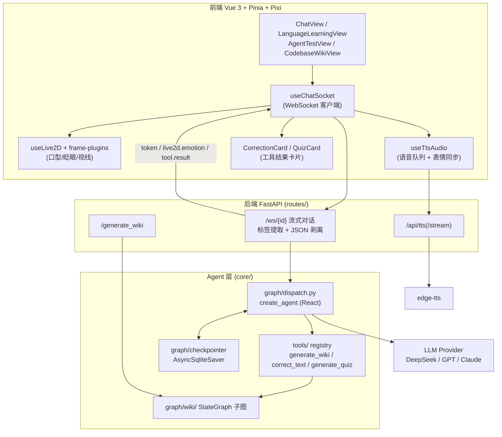
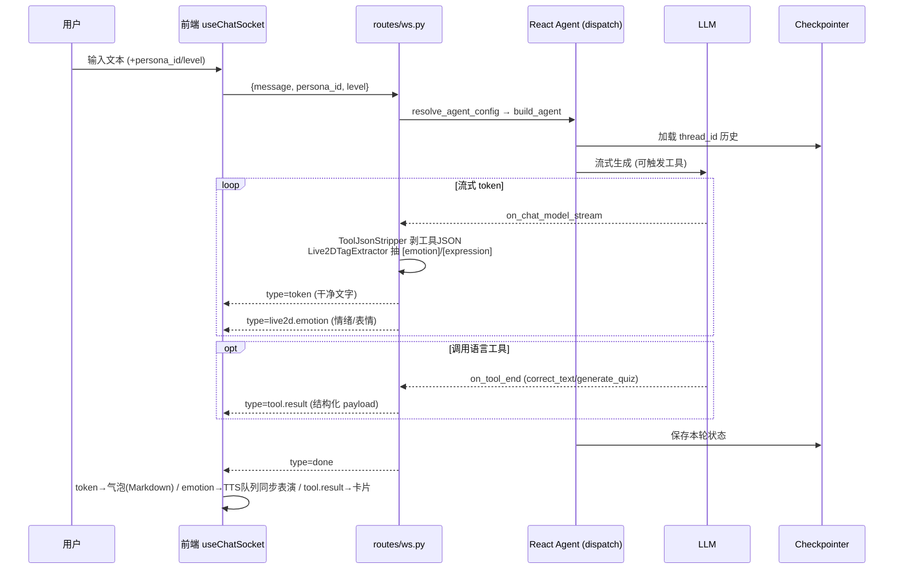
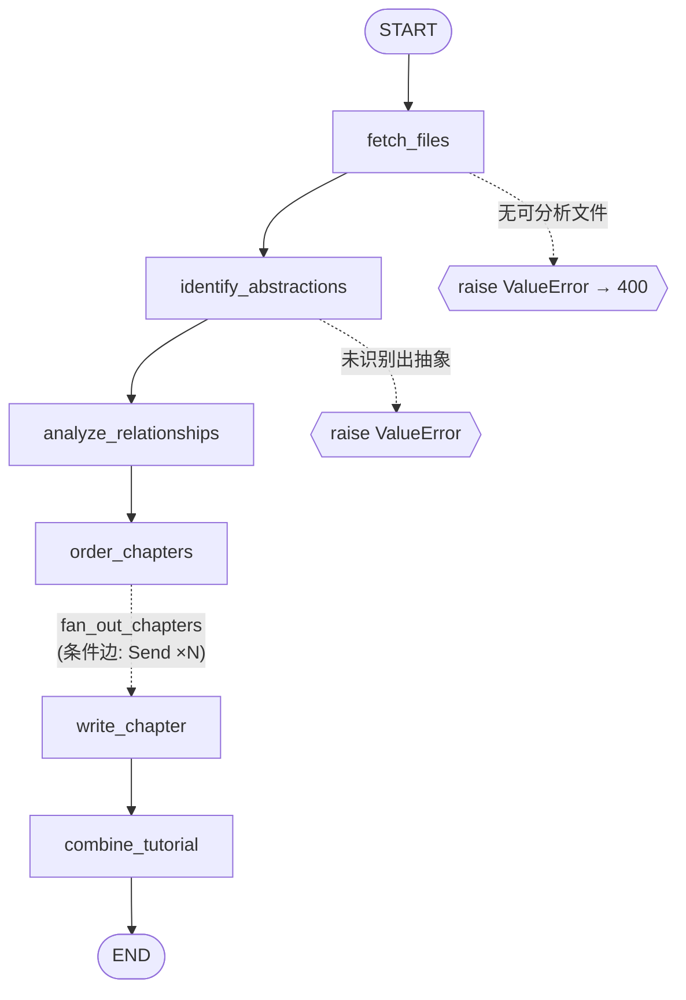
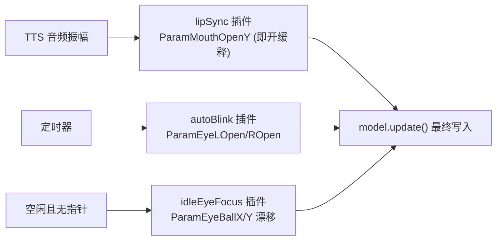
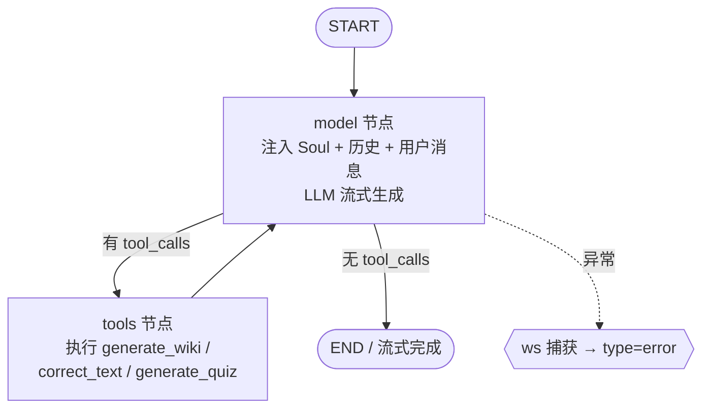
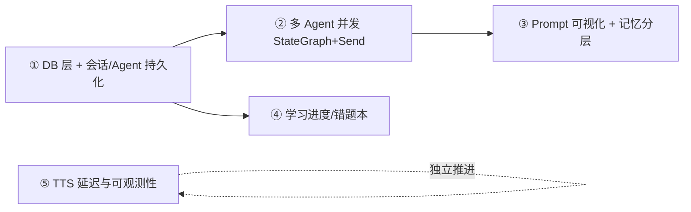

# 《Asuka 项目阶段性总结》PPT 设计文档

> 用途：阶段性汇报 PPT 的内容脚本与版式建议。
> 共 **15 页**，每页含「标题 / 版式建议 / 正文要点 / 讲者备注」。
> 所有结论均依据当前 `feat/language-teaching` 分支实际代码梳理，非规划稿。
> 图表统一用 Mermaid，可直接粘贴到支持 Mermaid 的工具或转成静态图导入 PPT。

---

## 第 1 页 · 封面

**版式**：居中标题 + 副标题 + 三能力 Tag + 日期/分支信息。

- 主标题：**Asuka — 多人格 AI 数字人助手**
- 副标题：阶段性总结 · 从「可对话 Agent」到「会教学、能解析代码、有形象的数字人」
- 三个能力 Tag（横排徽章）：
  - 🧩 **codebase2wiki** 代码库自动解析与文档生成
  - 🎭 **Live2D 数字人** 形象交互 / 语音表情驱动
  - 🗣️ **语言教学** 对话陪练 / 纠错 / 出题
- 页脚：技术栈 `Python 3.12 · uv · LangGraph · LangChain · FastAPI · Vue 3 · Pixi/Live2D`

**讲者备注**：一句话定位 ——「Asuka 是一个以 LangGraph 编排、带 Live2D 虚拟形象的 AI 应用，当前已打通三条可演示的核心能力线」。

---

## 第 2 页 · 项目概述

**版式**：左侧五项「定位/目标/用户/阶段/差异化」纵向卡片，右侧一句话愿景。

| 维度 | 内容 |
|---|---|
| **项目定位** | 以「**多人格 Agent + Live2D 数字人**」为载体的 AI 交互应用；底层用 LangGraph 编排，可承载对话、代码解析、语言教学等多种垂直能力。 |
| **核心目标** | 把「一个能干活的 Agent」升级为「**有形象、会教学、能理解代码**的数字伙伴」：对话即可触发工具（出题/批改/生成 Wiki），回复实时驱动数字人表演。 |
| **面向用户** | ① 语言学习者（中文母语，学英/日）；② 需要快速读懂陌生代码库的开发者；③ 想要带虚拟形象的 AI 陪伴/助手用户。 |
| **当前阶段** | 已完成 **Phase 1 脚手架 → Phase 2 可对话 Agent → Phase 3 Wiki 子图**，并在此之上叠加了 **Live2D 渲染/语音驱动** 与 **语言教学工作流** 两条功能线（均可端到端演示）。 |
| **差异化价值** | **三合一**：可对话的 LLM + 自动代码文档化（codebase2wiki）+ 语音/表情同步的 Live2D 数字人 + 结构化语言教学，全部在一套 LangGraph/LangChain 架构内复用同一条消息链路。 |

**讲者备注**：强调差异化不是「又一个聊天框」，而是「**文字回复 → 结构化工具结果（卡片）→ 语音 + 数字人表演**」的多模态闭环。

---

## 第 3 页 · 三大核心能力总览

**版式**：三栏并列卡片，每栏「一句话 + 关键代码模块 + 状态」。

| 🧩 codebase2wiki | 🎭 Live2D 数字人 | 🗣️ 语言教学 |
|---|---|---|
| 把本地目录 / GitHub 仓库自动解析为一套带 Mermaid 关系图的 Markdown 教程 | LLM 文本驱动的虚拟形象：情绪/表情标签、口型同步、与 TTS 语音对齐 | 面向中文母语者的英/日陪练：对话纠错、结构化批改、自动出题 |
| `core/graph/wiki/`（StateGraph 子图）+ `routes/wiki.py` + `tools/wiki_generator.py` | `routes/ws.py`（标签提取）+ 前端 `useLive2D` / `frame-plugins` / `useTtsAudio` | `core/tools/language.py` + `schemas.py` + 前端 `CorrectionCard`/`QuizCard` |
| **可演示**：Web 表单 / Agent 工具两种入口 | **可演示**：Frieren 模型 + 4 情绪 / 6 表情 + 口型 | **可演示**：persona 切换 + 等级 + 一键出题/批改 |

**讲者备注**：这三块共享同一条 WebSocket 流式链路与同一个 LangGraph Agent，区别只在「装配了哪些工具 + 哪个人格 Prompt」。

---

## 第 4 页 · 已实现功能矩阵（一）：能力清单

**版式**：表格，三色标记「✅ 已完成 / 🟡 部分完成 / ⚪ 原型或规划」。

| 模块 | 功能 | 状态 |
|---|---|---|
| **用户交互** | WebSocket 流式对话 `/ws/{conversation_id}`、同步 `/chat` 调试接口 | ✅ |
| **用户交互** | 前端 4 个页面：聊天 `/`、语言学习 `/learn`、Agent 测试台 `/agent`、Wiki `/wiki` | ✅ |
| **Agent / 编排** | LangGraph 预构建 React Agent（`create_agent`），按人格装配工具 | ✅ |
| **Agent / 编排** | 多人格 persona：default / english_teacher / japanese_teacher | ✅ |
| **Agent / 编排** | 多 Agent 并发（`StateGraph` + `Send` 分支） | ⚪ 规划 |
| **codebase2wiki** | StateGraph 子图（6 节点）+ Send 并发写章 + Mermaid 关系图 | ✅ |
| **codebase2wiki** | 数据源：本地目录 + GitHub zipball 下载（路径穿越校验） | ✅ |
| **codebase2wiki** | LLM 响应缓存、增量进度事件、超大仓库 map-reduce 分批 | ⚪ 规划 |
| **Live2D** | Pixi + cubism4 渲染、情绪/表情标签驱动、口型 + 自动眨眼 + 视线漂移 | ✅ |
| **Live2D** | TTS 流式合成（edge-tts）+ 语音/表情同步队列 | 🟡 已通，首块/块间延迟待优化 |
| **语言教学** | 对话陪练、`correct_text` 结构化批改、`generate_quiz` 出题（选择/填空/翻译） | ✅ |
| **语言教学** | 工具结果卡片化（CorrectionCard / QuizCard）、出题时按段落朗读 | ✅ |

**讲者备注**：先讲「✅ 全部可现场演示」，再点「🟡/⚪」过渡到最后两页的未完成清单。

---

## 第 5 页 · 已实现功能矩阵（二）：后端 / 数据 / 工具

**版式**：左「后端 API / 服务」+ 右「数据 / 记忆 / 工具」两栏。

**后端 API / 服务模块（`asuka/`）**
- `main.py`：FastAPI 入口，挂载 `chat / tts / wiki / ws` 路由 + `/health`
- `routes/ws.py`：流式对话 + Live2D 标签实时提取 + 语言工具 JSON 剥离
- `routes/wiki.py`：`POST /generate_wiki`（本地目录 / GitHub 仓库）
- `routes/tts.py`：`POST /api/tts` 与 `/api/tts/stream`（edge-tts → MP3）
- `api/provider/`：`get_llm()` 按前缀路由 DeepSeek / GPT / Claude；`tts.py` 语音合成

**数据存储与记忆机制**
- **多轮记忆**：LangGraph `AsyncSqliteSaver` checkpointer，`thread_id = conversation_id`，落盘 `data/sessions.db`
- **配置**：`config.py`（pydantic-settings，从 `.env` 读取，Key 不硬编码）
- 🟡 中期记忆（摘要）、长期记忆（RAG）、业务 DB（Agent/会话表）暂未建，靠 checkpointer 全量历史

**工具调用 / 插件扩展**
- `tools/registry.py`：按 `agent_id` 分配工具（默认→`generate_wiki`；教师→`correct_text`+`generate_quiz`）
- 工具均为 LangChain `@tool`，由 React Agent 自主决定调用
- ⚪ 插件热加载 / 沙箱隔离未建（`registry.py` 当前写死注册）

**讲者备注**：突出「记忆=checkpointer」这一极简但有效的设计选择，避免过早引入数据库。

---

## 第 6 页 · 整体技术架构

**版式**：三层架构图（前端 / 后端 API / Agent 层），底部标注外部依赖。

**讲者备注**：一句话——「`routes/` 只做 HTTP↔core 映射，业务全在 `core/`，LLM/TTS 是可替换的外部 provider」。

---

## 第 7 页 · 消息完整链路（用户输入 → Agent 回复）

**版式**：泳道时序图，强调「三种输出事件」如何分流到前端三个消费者。

**关键设计**：后端在流中**实时**做两件清洗——
1. `ToolJsonStripper`：模型若把工具 JSON 复述进正文，按括号配对剔除，避免聊天气泡冒出大段 JSON；
2. `Live2DTagExtractor`：跨分片缓冲，提取完整 `[emotion:…]`/`[expression:…]` 标签 → 发结构化事件，token 文本保持干净（不进 TTS、不显示）。

**讲者备注**：这页是全篇技术核心，说明「一条流同时承载 文字 / 表演 / 卡片 三类信息」。

---

## 第 8 页 · codebase2wiki 处理流程

**版式**：左「输入与入口」+ 中「6 步流水线」+ 右「输出物」。

**两个入口（共用同一子图 `build_wiki_graph()`）**
- 对话工具：Agent 调用 `generate_wiki(project_path, language)`
- REST 表单：`POST /generate_wiki`（支持本地 `dir` 或 GitHub `repo`，二选一校验）

**六步流水线（移植自 `ref/Tutorial-Codebase-Knowledge` 的 PocketFlow 6 节点）**
1. **fetch_files**：按 include/exclude 模式 + 单文件大小上限遍历收集源码
2. **identify_abstractions**：LLM 识别 top-N 核心抽象（概念/模块）+ 关联文件下标
3. **analyze_relationships**：LLM 生成项目摘要 + 抽象间关系边（from/to/label）
4. **order_chapters**：LLM 决定教学章节顺序（去重补全保证每抽象恰好一章）
5. **write_chapter ×N**：`Send` 并发，每章拿到「全章目录 + 前后邻居 + 本章相关文件片段」
6. **combine_tutorial**：汇聚草稿，写 `index.md`（含 **Mermaid 关系图**）+ 各章节 `NN_xxx.md`

**关键工程点**
- 结构化输出用 `with_structured_output(method="function_calling")` —— 兼容不支持 `json_schema` 的 DeepSeek
- GitHub 下载走 zipball，解压时做**路径穿越校验**（防止 zip slip）
- 索引化上下文：文件用 `--- File Index i ---` 编号，LLM 只回传下标，降低出错与 token

**讲者备注**：强调「这是把一个开源 PocketFlow 教程生成器，工程化重写为 LangGraph 子图，并接入了对话工具 + Web 表单两种用法」。

---

## 第 9 页 · LangGraph 状态图（一）：codebase2wiki 子图 ⭐

**版式**：大图居中，下方「节点职责 / 分支 / 错误路径」三小块。

**节点职责（状态贯穿 `WikiState` TypedDict）**

| 节点 | 职责 | 读 / 写 state |
|---|---|---|
| `fetch_files` | 遍历目录收集 `(路径, 内容)` | 写 `files` |
| `identify_abstractions` | LLM→`IdentifyResult`，过滤越界下标 | 写 `abstractions` |
| `analyze_relationships` | LLM→`RelationshipsResult`，校验边端点 | 写 `relationships{summary,details}` |
| `order_chapters` | LLM→`OrderResult`，去重+补全 | 写 `chapter_order` |
| `write_chapter`（并行） | 单章正文，输出 `ChapterDraft` | 经 `operator.add` reducer 累加进 `chapters` |
| `combine_tutorial` | 拼 index + 章节 + Mermaid，落盘 | 写 `final_output_dir` |

**条件分支**：`order_chapters` 后用 `add_conditional_edges(..., fan_out_chapters, ["write_chapter"])`，按章节数动态 `Send` 出 N 个并行分支；并行结果靠 `Annotated[list, operator.add]` 归并，再按 `chapter_num` 排序。

**错误处理路径**：`fetch_files` 无文件、`identify_abstractions` 无抽象时 `raise ValueError`；`routes/wiki.py` 捕获并转 `HTTP 400`。单章 LLM 缺失时 `combine_tutorial` 用「（内容缺失）」占位，保证整体产出不中断。

**讲者备注**：这是「**扇出-归并（map-reduce）**」的典型 LangGraph 模式，重点讲条件边 + reducer。

---

## 第 10 页 · Live2D 数字人驱动流程

**版式**：上「驱动信号来源」+ 下「前端每帧渲染管线」。

**驱动信号（后端 → 前端事件）**
- LLM 在文字里嵌入控制标签 → 后端 `Live2DTagExtractor` 抽取 → `type=live2d.emotion` 事件
- **情绪**（4 种）：`idle / think / happy / sad` → 映射到动作组 `Idle/Think/Happy/Sad`
- **表情**（Frieren 模型 6 种）：`mmy / anya / anya2 / W / lks / wh`
- 标签**不显示、不进 TTS**，由 System Prompt（`AgentConfig.soul`）约束模型按需、节制使用

**语音/表情同步（关键体验）**
- TTS 经 `useTtsAudio` 入**播放队列**；`attachVisualCue` 把情绪/表情**挂到对应语音段**
- 表演在「该段语音真正播放时」才切换，而非标签解析瞬间 → 口型、表情、声音对齐
- 出题场景特判：`quizTtsMode` 只朗读开场白与结尾，不念题目正文

**前端每帧渲染管线（`frame-plugins`，挂在 SDK `beforeModelUpdate`）**

**讲者备注**：强调「插件在 motion/expression/SDK 之后写参数，是**最终值**，不会被动作曲线覆盖」；眨眼接管时禁用 SDK 内置 eyeBlink 防双写。

---

## 第 11 页 · 语言教学：生成 / 纠错 / 反馈机制

**版式**：左「两个工具的输入输出」+ 右「前端卡片与朗读策略」。

**人格与工具装配**
- `english_teacher`（Emily）/ `japanese_teacher`（Asuka），按 `level` 注入 Soul（CEFR A1–C2 / JLPT N5–N1）
- 教师人格挂载工具 `correct_text` + `generate_quiz`；语言/题型支持中英别名归一化（如「填空」→`cloze`）

**纠错机制 `correct_text` → `CorrectionResult`**
- 逐条 `CorrectionItem`（错误类型 / 原文 / 改正 / 中文解释）
- `natural_rewrite`（地道改写）+ `annotation`（英=IPA，日=假名+罗马音）+ `encouragement_zh`
- 检查清单内置：英语（冠词/时态/单复数/介词/主谓一致）、日语（助词/敬体敬语/自他/授受/长短促音）

**出题机制 `generate_quiz` → `QuizSet`**
- 三种题型：`mcq`（≥4 选项）/ `cloze`（含 `___`）/ `translation`
- 每题含中文解析 + 发音标注；数量 1–10，难度匹配等级

**鲁棒性**：两工具都用「普通 LLM 调用 + JSON 提取」而非依赖 provider response_format；解析失败时返回**结构化兜底**（fallback），保证 LangGraph 的 tool call 一定被完整响应，不污染状态机。

**反馈呈现（前端）**
- `tool.result` 事件 → `CorrectionCard` / `QuizCard` 渲染，**不在聊天气泡重复 JSON**
- 朗读策略：批改/普通回复整段朗读；出题只读「开场 + 结尾」，题面留给卡片

**讲者备注**：核心卖点——「教学反馈是**结构化卡片**而非一坨文字，且和数字人语音/表情联动」。

---

## 第 12 页 · 记忆 / 上下文 / Prompt / 工具调用的组织

**版式**：四象限。

| 🧠 记忆 | 🧵 上下文 |
|---|---|
| LangGraph `AsyncSqliteSaver` checkpointer；`thread_id = conversation_id`，跨轮自动存取，落盘 `sessions.db` | 每轮只传新 `HumanMessage`，历史由 checkpointer 注入；`build_agent` 按 `id:level:model` 缓存 compiled graph |

| 📝 Prompt | 🔧 工具调用 |
|---|---|
| 人格 Soul 即 System Prompt：default 含完整「Live2D 标签规范」；teacher 含教学规则 + 工具触发指引 + 等级占位 | React Agent 自主决定调用；`registry` 按 agent_id 分配；`@tool` 返回 JSON 字符串，`on_tool_end` 转 `tool.result` 下发 |

**讲者备注**：说明「我们刻意没做复杂的记忆分层，靠 checkpointer 一招覆盖多轮上下文；Prompt 即人格，工具即能力边界」。

---

## 第 13 页 · LangGraph 状态图（二）：对话主图（React Agent Loop）

**版式**：主图 + 节点说明。

**节点职责**
- **model**：由 `create_agent(model, tools, system_prompt, checkpointer)` 预构建；负责拼 Prompt、调用 LLM、产出回复或工具调用请求
- **tools**：执行被请求的 LangChain 工具，结果回灌为 `ToolMessage` 再回到 model
- **条件分支**：model 输出是否含 `tool_calls` → 决定「再走一圈工具」或「结束」
- **错误处理**：`routes/ws.py` 统一 `try/except`，异常下发 `type=error` 并 `tts.stop()`；语言工具自带 fallback，保证 tool 循环可闭合

**与 Wiki 子图的关系**：主图是「对话循环」，Wiki 子图是被 `generate_wiki` 工具**内部 `ainvoke` 调用**的独立 StateGraph —— 两图分层、各自可单测。

**讲者备注**：点明「当前是**单 Agent** React 循环，多 Agent 并发（`StateGraph`+`Send`）是下一步」，自然过渡到未完成页。

---

## 第 14 页 · 未完成 / 简化功能（一）：架构与编排

**版式**：表格，标注「当前简化做法 / 补全时机」。

| 领域 | 功能 | 当前简化做法 | 补全时机 |
|---|---|---|---|
| **多 Agent** | 并发多人格回应 | 单 React Agent，工具按人格切换 | 改 `StateGraph` + `Send` 并发分支 |
| **会话层** | `session/manager`、`context` | `conversation_id` 直接当 `thread_id` | 需多会话生命周期 / Session 池时 |
| **Agent 配置** | registry / persona / runtime / DB 持久化 | 硬编码 3 个 preset，无业务 DB | DB 层 + Agent CRUD 就绪时 |
| **记忆** | 中期摘要 / 长期 RAG | 仅 checkpointer 全量历史 | 上下文增长 / 知识库阶段 |
| **Prompt** | 可视化 / token 快照 | 无，Soul 直接交给 Agent | Prompt 可视化模块 |
| **插件** | 热加载 + 沙箱隔离 | `registry` 写死注册工具 | 接第三方/不可信工具时 |
| **Provider** | GPT / Claude 实跑验证 | 仅实测 DeepSeek，另两条已写未验 | 需切换模型时逐个验证 |

**讲者备注**：用一句收口——「这些不是缺陷，是为最快打通端到端而**主动延后**的项，均有明确触发条件」。

---

## 第 15 页 · 未完成 / 简化功能（二）：能力线与路线图

**版式**：上「按三能力线的待办」+ 下「近期路线图」。

**codebase2wiki 待补**
- LLM 响应缓存（控成本）、生成中**实时进度事件**、超大仓库 **map-reduce 分批**、跨章节连贯性（顺序 reduce）

**Live2D / TTS 待补**
- TTS **首块延迟 / 块间延迟**优化（评估低延迟/本地 TTS、双缓冲、首句切分）
- TTS 队列**可观测性**（入队/合成/播放/失败 trace）

**语言教学待补**
- 学习进度 / 错题本持久化（依赖 DB 层）、更多语言与题型扩展

**整体待补**
- 鉴权 / 多用户、PostgreSQL 切换、Electron / PWA 桌面打包、WebSocket 断线重连精细化

**近期路线图（建议优先级）**

**讲者备注**：收尾——「当前已验证**架构可行 + 三条能力线可演示**；下一阶段重心是**持久化与多 Agent 并发**，把单人格升级为多人格共存」。

---

> 附：图表渲染建议 —— Mermaid 可用 [mermaid.live](https://mermaid.live) 导出 PNG/SVG 后贴入 PPT；表格建议转为 PPT 原生表格以便统一配色（呼应前端已有的 AIRI 风格亮/暗主题）。
